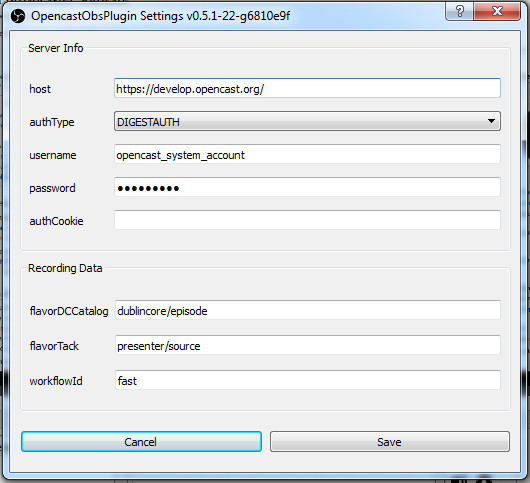
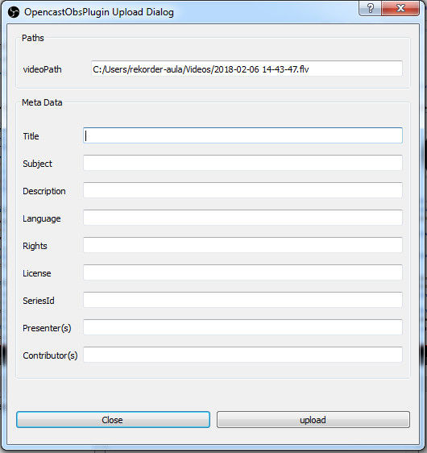
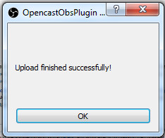

# OpencastObsPlugin
--------------------------------

A Plugin for OBS, which allows recorded files to be uploaded directly to Opencast


## How to install

### Binaries

1. [Download](https://github.com/elan-ev/opencast-obs-plugin/releases) the Plugin
2. Linux only: Install tinyxml2 and libconfig
3. Extract the zip file into your obs plugin folder

Usual locations of the obs plugin folder:

- Windows 32-bit: `C:\Program Files (x86)\obs-studio\obs-plugins\32bit\`
- Windows 64-bit: `C:\Program Files (x86)\obs-studio\obs-plugins\64bit\`
- Ubuntu: `/usr/lib/obs-plugins/`

### Self compiled

1. Put the compiled binaries into the obs plugin folder (see above)
2. Windows only: Add the missing dependencies(tinyxml2, libconfig) to the obs plugin folder


## How to use

### Configuration

Before the plugin can be used it has to be configured.
The Settings-Dialog can be found under `Tools`.


Here you can enter the address of the server and the authentication details.




### Usage


After stopping a recording the following dialog will open.



All details for the recording can be set here.
When you are finished entering the details, the upload process can be started by clicking on upload.

Do not close obs-studio while the upload is active, or the uploading process will be aborted.
Once the upload process is finished you will get notified.




## How to Build

### Requirements

- CMake
- C++ Compiler (C++11 support needed)
- obs-studio (20.0.1 compatible + libobs and headers)
- qt (5.9.2 compatible)
- libconfig (1.5 compatible)
- [libOpencastIngest](https://github.com/elan-ev/lib-opencast-ingest) (0.4.0 compatible)
    - add header files into `libs/libOpencastIngest/include`
        - `libOpencastIngest.hpp`
        - `libOpencastIngest.h`
    - add the static library binary to `libs/libOpencastIngest/lib/libOpencastIngest.{a|lib}`
          - This library also requires: libcurl, tinyxml2


### How to build on Linux

1. Clone the source repository: [OpencastObsPlugin](https://github.com/elan-ev/opencast-obs-plugin)
2. Install the required programs as development versions with header files (you can use your package manager)
3. Put the files of libOpencastIngest according to the requirements into the source directory
4. Execute the following commands in the source tree (this should create a file, which is called: `libobsOpencastIngestPlugin.so` in the `build/` directory):
```bash
mkdir build
cd build/
cmake -DCMAKE_BUILD_TYPE=Release ..
cmake --build .
```


### How to build on Windows (not Recommended)

With [msys2](http://www.msys2.org/) installed you can perform the following steps:

1. Clone the source repository: [OpencastObsPlugin](https://github.com/elan-ev/opencast-obs-plugin)
2. Install the Microsoft Visual C++ Compiler (Visual Studio or Visual Studio Build Tools 15 2017)
3. Use the MinGW 32-bit/64-bit console
4. Install the Requirements (libcurl, tinyxml2, libconfig) (watch out to use the correct architecture/build chain) by compiling the install target with cmake (admin rights needed).
5. Put the files of libOpencastIngest according to the requirements into the source directory
6. Install qt 5.9.2 for msvc2015 and msvc2017_x64 to the default path
7. Compile obs-studio relative to the source directory of opencastObsPlugin: `../obs-studio/build/`, on 32-bit:  `../obs-studio/build32/` (cmake target obs)
8. Then execute the following commands (this should create a file, which is called `obsOpencastIngestPlugin.dll` in the `build/Release/` directory):

32-bit (on MinGW 32-bit console):
```bash
mkdir build
cd build/
cmake -G "Visual Studio 15 2017" -DCMAKE_BUILD_TYPE=Release ..
cmake --build . --config Release
```
64-bit (on MinGW 64-bit console):
```bash
mkdir build
cd build/
cmake -G "Visual Studio 15 2017 Win64" -DCMAKE_BUILD_TYPE=Release ..
cmake --build . --config Release
```

Warning: You can only have one version of the libraries (32/64-bit) installed, so if you want to build 32 and 64-bit versions you have to remove the other version of the libraries first.
